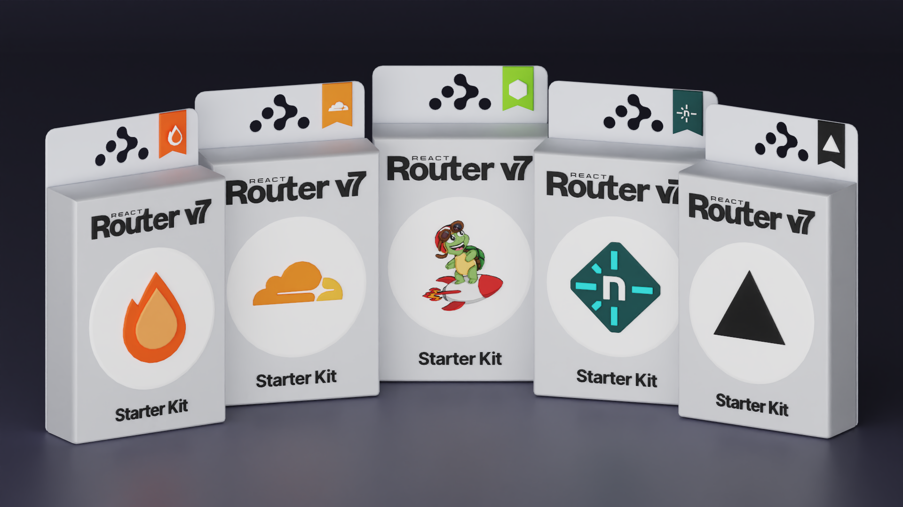

# React Router Templates



You can quickly create a new React Router application from any of these templates using the `create-react-router` CLI.

```bash
npx create-react-router@latest --template remix-run/react-router-templates/<template-name>
```
